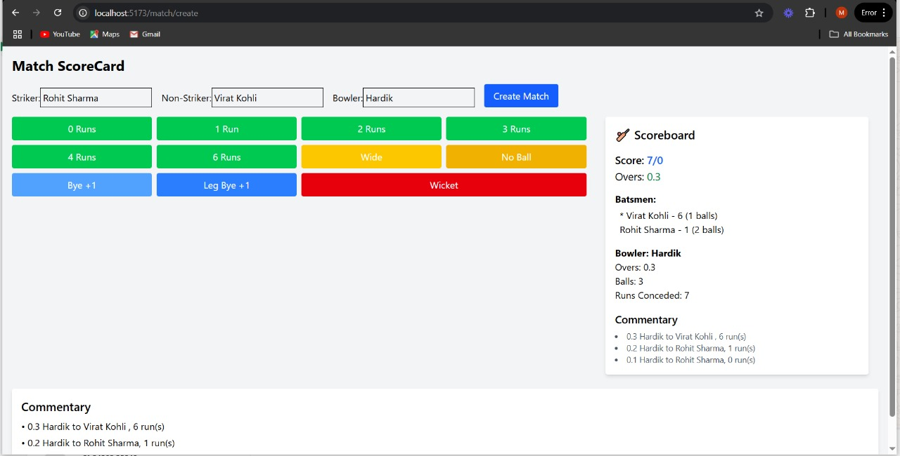

# 🏏 Cricket Scoring Application

A full-stack **Cricket Scoring Application** that allows users to track live scores, manage players, and monitor match progress in real time. Built using **React**, **Tailwind CSS**, **Vite**, **Express.js**, **MongoDB**, and **Socket.IO**.

---

## 🚀 Features

- 🧑‍🤝‍🧑 Real-time score updates using Socket.IO
- 📝 Create and manage matches
- 🏏 Add players and track their performance
- 🔄 Handle all cricket scenarios (wides, no-balls, overthrows, leg-byes, etc.)
- 📈 Display live scoreboards
- 💬 Team and player-based statistics
- 🎯 Interactive scoring panel for admins
- 📊 User-friendly and responsive UI with Tailwind CSS

---

## 🛠 Tech Stack

### 🔹 Frontend
- React 19
- Vite
- Tailwind CSS
- React Router DOM
- Axios
- Socket.IO Client

### 🔸 Backend
- Node.js
- Express.js
- MongoDB + Mongoose
- Socket.IO
- dotenv, cors

---

## 📁 Project Structure

```
cricket-scoring-app/
├── frontend/         # React App
│   ├── src/
│   └── package.json
│
├── backend/          # Express + MongoDB Server
│   ├── models/
│   ├── routes/
│   ├── controllers/
│   ├── server.js
│   └── package.json
│
└── README.md
```

---

## 🧑‍💻 Getting Started

### 1️⃣ Clone the repository

```bash
git clone https://github.com/your-username/cricket-scoring-app.git
cd cricket-scoring-app
```

### 2️⃣ Start the Backend

```bash
cd backend
npm install
```

Create a `.env` file in the `backend/` directory:

```ini
MONGO_URI=your_mongodb_connection_string
PORT=5000
```

Run the server:

```bash
npm start
```

Backend should be running at: `http://localhost:5000`

### 3️⃣ Start the Frontend

```bash
cd ../frontend
npm install
npm run dev
```

Frontend will be available at: `http://localhost:5173`

---

## 📸 Screenshots

### 💻 Desktop View



---

## 🧪 Example Use Cases

- Create a match → Add teams → Add players → Start scoring
- Track overs, balls, runs, wickets live
- View player stats and match summary
- Real-time updates on the scoreboard

---

## 🤝 Contributing

Contributions are welcome!

1. Fork the repo
2. Create your feature branch (`git checkout -b feature/feature-name`)
3. Commit your changes (`git commit -m 'Add feature'`)
4. Push to the branch (`git push origin feature/feature-name`)
5. Open a pull request


---

## 🙋‍♂️ Author

**Mohd Kasif Khan**

- 🧑‍💻 GitHub: [github.com/your-username](https://github.com/your-username)
- 🔗 LinkedIn: [linkedin.com/in/your-link](https://linkedin.com/in/your-link)
